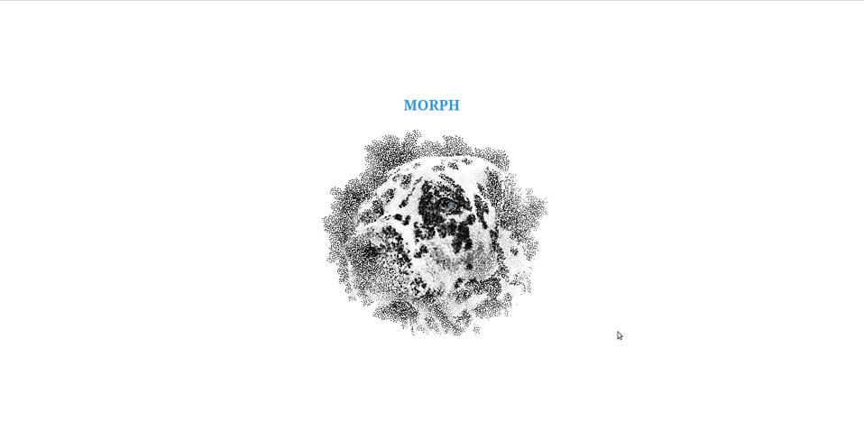

# Morph TS



[DEMO](https://alekstar79.github.io/morphing)

All functionality is implemented using Typescript and Vite

**How to use:**

Just clone or download this repository. Install packages and run scripts from packages.json
That's all...

Clone this repo:
```shell
git clone git@github.com:alekstar79/morph.git
```
Go to project directory:
```shell
cd morph
```
Install packages
````shell
npm install
````

Start development
````shell
npm run dev
````
Build for production
````shell
npm run build
````
View the assembled project
````shell
npm run preview
````
